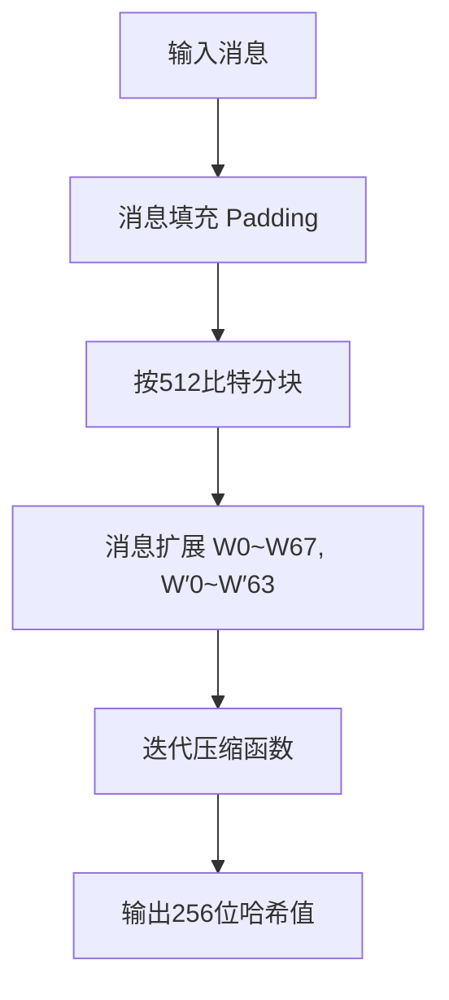
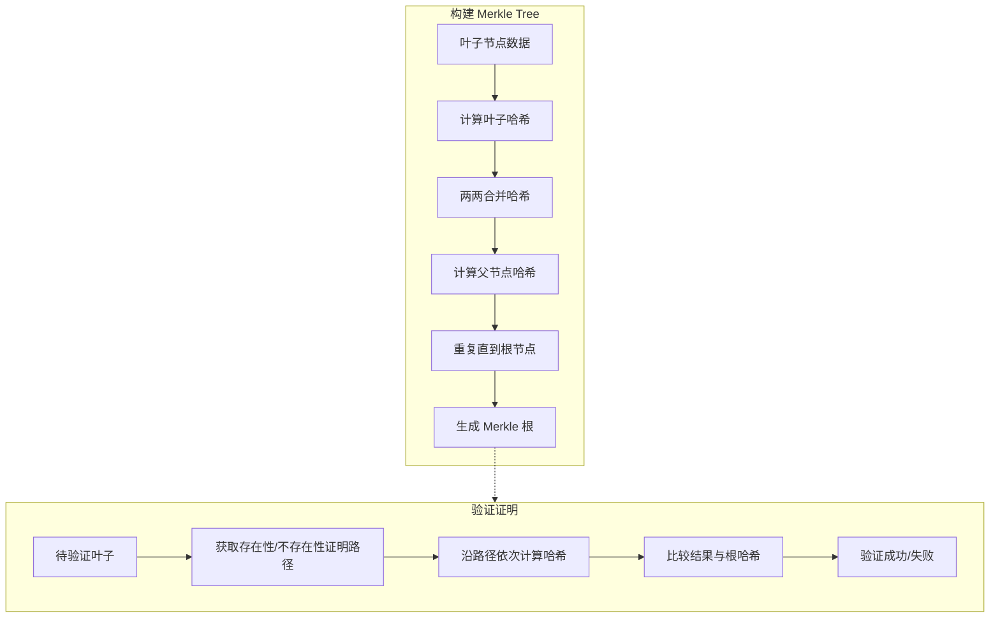

# Project 4: SM3的软件实现与优化

## 一.项目简介

本项目基于国密哈希算法SM3，完成了其基础软件实现及多项优化。主要内容包括：
- SM3的基础版本实现，符合国密标准
- 基于算法优化的SM3加速实现
- SM3的长度扩展攻击验证
- 基于SM3实现的Merkle树构建，支持多达10万叶子节点
- Merkle树的叶子节点存在性证明与不存在性证明的构造与验证

该项目旨在通过理论与代码实现相结合，深入理解SM3算法和Merkle树的核心机制，同时验证密码学中的长度扩展攻击原理。

## 二.实验原理

### 1. SM3算法简介

SM3是中国国家密码管理局发布的密码杂凑函数，输出256位哈希值。算法主要包括消息填充、消息扩展、压缩函数迭代三个阶段。

### 2. SM3软件实现与优化

- **基础实现**: 直接按照SM3标准（GM/T 0004-2012）实现消息填充、消息扩展和压缩函数。
- **优化实现**: 通过减少重复计算，优化消息扩展阶段的部分操作，提高软件执行效率。

### 3. 长度扩展攻击

利用Merkle–Damgård结构的特性，攻击者可通过原消息的哈希值和消息长度，伪造带有附加数据的新消息哈希，验证SM3对长度扩展攻击的脆弱性。

### 4. Merkle树构建

基于RFC6962标准，实现多层哈希树构建，支持：
- 大规模叶子节点（测试中达到10万节点）
- 叶子的存在性证明（Proof of Inclusion）
- 叶子的不存在性证明（Proof of Non-Inclusion）
通过树结构，确保数据完整性和快速验证。

## 三.协议流程图

以下为SM3哈希及Merkle树构建的主要流程示意图（采用Mermaid语法）：






## 四.项目结构

```
├── sm3_basic.py             # SM3基础实现代码
├── sm3_optimized.py         # SM3优化版本代码
├── sm3_len_ext_attack.py    # 长度扩展攻击演示代码
├── merkle_tree.py           # Merkle树构建及证明相关代码
├── intergity.py             # 综合的完整代码
```


## 五.使用说明

### 1.环境准备

    - Python 3.7及以上版本
    - 无额外依赖（标准库实现）

### 2.运行示例
```
python sm3_basic.py          # 运行基础SM3测试 
python sm3_optimized.py      # 运行优化版SM3测试 
python length_extension.py   # 验证长度扩展攻击 
python merkle_tree.py        # 构建Merkle树及验证证明
```

### 3.预期输出

```
[基础 SM3] 66c7f0f462eeedd9d1f2d46bdc10e4e24167c4875cf2f7a2297da02b8f4ba8e0
[优化 SM3] 66c7f0f462eeedd9d1f2d46bdc10e4e24167c4875cf2f7a2297da02b8f4ba8e0
[长度扩展攻击] 原哈希: 55e12e91650d2fec56ec74e1d3e4ddbfce2ef3a65890c2a19ecf88a307e76a23
[长度扩展攻击] 新哈希: 0fe014f5babb576d28b582725c21ff8add58dff0e55dd699f39e1f492b0fab3c
[Merkle Tree] 10000 叶子构建完成, 耗时 9.08 秒
[Merkle Root] e90ecc8c72696d9988e7bc47e4a8c23b5b57595450be1e0d96c4124fd010897b
[存在性验证结果] True
[不存在性验证结果] False
[性能测试] 100000 叶子构建耗时: 89.50 秒

```

