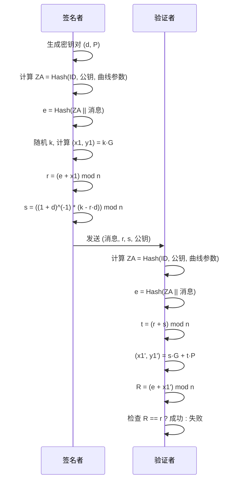

## Project5：SM2 签名算法安全漏洞演示

## 一.项目简介

本项目实现了 **SM2 数字签名算法** 的 Python 版本，并基于此进行多种安全性分析与攻击演示，包括：
- 基础的 SM2 密钥生成、签名与验签流程
- 常见签名算法误用攻击（如 k 重用、相同 d 与 k 攻击）
- 签名延展性（Malleability）演示
- 伪造“中本聪”签名的概念性演示

***
## 二.实验原理

SM2 是国密算法中基于椭圆曲线密码学（ECC）的公钥密码算法，签名流程大致如下：
1. **生成密钥对** ：私钥 `d` 为 [1, n-1] 之间的随机整数，公钥 `P = d·G`。

2. **计算用户标识哈希 ZA**：ZA = Hash(ENTL || ID || a || b || Gx || Gy || Px || Py)

3. **计算 e** ：e = Hash(ZA || M)

4. **生成签名 (r, s)**  
	- 随机选择 `k`  
	- 计算椭圆曲线点 `(x1, y1) = k·G`  
	- `r = (e + x1) mod n`  
	- `s = ((1 + d)^(-1) * (k - r·d)) mod n`

5. **验证签名** ：验证 `(r, s)` 是否满足公式：R = (e + x1') mod n == r，其中 `(x1', y1') = s·G + t·P`，`t = (r + s) mod n`。

---
## 三.协议流程图



***
## 四.项目结构
```
├── sm2_core.py      # SM2 核心实现
├── sm2_utils.py     # SM2 辅助工具
├── sm2_pitfalls.py  # 演示攻击脚本
├── sm2_forgery.py   # 伪造签名演示
└── README.md        # 项目说明文件
```

---

## 五.安装与运行

### 1️.环境依赖
本项目仅依赖 Python 标准库：
- `hashlib`
- `secrets`
- `typing`
建议 Python 版本 ≥ 3.8。

### 2.运行代码
```
python sm2_core.py
python sm2_forgery.py
python sm2_pitfalls.py
```

### 3.预期输出

**`sm2_core.py` 预期输出**

```
=== SM2实现测试 ===
私钥: 33003707066265338715182025965593713717588328479371389959959763640026808612850
公钥: (25829312702547681812958952567194956646247963239749613801306993096599315496066, 7844554866402280985772298034704780215378784086552322867011401272426034583593)
签名: (r=28997312669025208529633606216330037304770235072392717979161595629309694701075, s=53440090527105717393672446017967077219027713383105743195016782130349393000564)
验证结果: 成功
伪造签名验证: 正常失败
```

**`sm2_pitfalls.py` 预期输出**

```
===== k重用攻击演示 =====
k重用攻击结果:
原始dA: 6651515597854939951589508407182230879882827356641006480556335688357627172228, 恢复dA: 6651515597854939951589508407182230879882827356641006480556335688357627172228, 成功
原始dB: 55375441044903261571196674417093522053571283798656114697260606587279208861733, 恢复dB: 55375441044903261571196674417093522053571283798656114697260606587279208861733, 成功

===== 相同d和k攻击演示 =====

相同d和k攻击结果:
原始d: 59144055708365447525752432446558714271072341851418515202548400074211608805525
恢复d: 55913224031219982976419737345967393376949661113153467691934473672144912742185
失败
```

**`sm2_forgery.py` 预期输出**

```
===== SM2 签名延展性演示 =====
原始签名: r=28781547035529949578003072741291745391530094527036453418720067303529760020848
原始签名: s=17260300009936208564557646231167126311091235278721707883962011440706698236157
延展性签名: r=28781547035529949578003072741291745391530094527036453418720067303529760020848
延展性签名: s=43015401999308887821128525284052770104828409419731716171599653810623598045370
原始签名验证结果: 成功
延展性签名验证结果: 失败

===== 伪造中本聪签名演示 =====

伪造交易内容: 中本聪向攻击者转移 100 BTC
伪造签名 (SM2): r=33955151518508917839518246433441186035599288112317400463956520707037401896637
伪造签名 (SM2): s=42651766923259568311896533126465455256103814345262251829743488710044848519114
伪造签名验证结果: 成功

注意：
- 真实比特币使用 ECDSA 在 secp256k1 曲线上，**不是 SM2**。
- 本演示仅在 SM2 场景下展示“伪造”概念，无法直接攻击比特币。
- 真实场景伪造需要：
  1. 中本聪真实的 secp256k1 公钥  
  2. 该密钥存在 k 重用等漏洞
```

***
## 六.安全性与攻击分析

### 1. k 重用攻击
- 如果相同的随机数 `k` 被用于两条不同消息的签名，攻击者可通过两组 `(r, s)` 恢复私钥 `d`。
### 2. 相同 d/k 攻击
- 若同时使用相同私钥与随机数在 SM2 与 ECDSA 中签名，可建立方程组直接求出私钥。
### 3. 签名延展性
- `(r, s)` 与 `(r, -s mod n)` 在验证时均为有效签名，可被滥用进行交易重放攻击。
### 4. 伪造“中本聪”签名
- 仅为教学演示，展示如何在 SM2 环境下生成任意人的“签名”，不能直接攻击比特币网络。

***