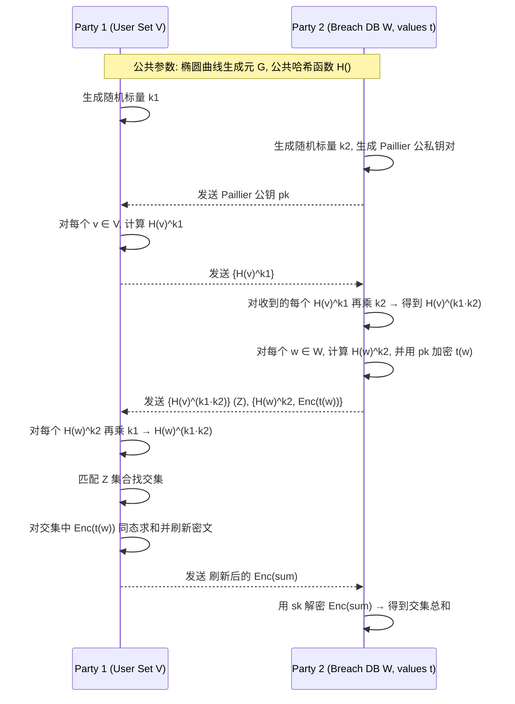

## Project6：Google Password Checkup 

本项目实现了 Google Password Checkup 论文（[ePrint 2019/723](https://eprint.iacr.org/2019/723.pdf)）中 Figure 2 所描述的 **DDH-based Private Intersection-Sum Protocol**，并通过实验验证了协议的正确性。

## 📖 实验原理

该协议用于在 **双方集合交集计算** 的同时，**安全地对交集元素关联的数值进行求和**，且不会泄露各自集合中非交集元素的信息。

本实现基于：
- **椭圆曲线 Diffie-Hellman (ECDH)** 用于集合元素匹配
- **Paillier 同态加密** 用于加密并同态求和交集元素的数值
- **密文刷新（rerandomization）** 防止密文链接攻击

协议运行三轮（P1: Party 1，P2: Party 2）：
1. **Round 1**  
   - P1 对集合中每个元素 v 进行哈希映射到曲线点 `H(v)`  
   - 用随机标量 k1 执行点乘，得到 `H(v)^k1`，发送给 P2
2. **Round 2**  
   - P2 对收到的每个点再乘 k2，得到 `H(v)^(k1·k2)`  
   - 对自己的集合 w 计算 `H(w)^k2`，并用 Paillier 公钥加密其关联值 t(w)  ·
   - 将 `Z = {H(v)^(k1·k2)}` 和 `{H(w)^k2, Enc(t(w))}` 发给 P1
3. **Round 3**  
   - P1 对 `{H(w)^k2}` 再乘 k1 得到 `H(w)^(k1·k2)`  
   - 比对 Z 找到交集元素索引  
   - 对交集中 `Enc(t(w))` 同态求和并刷新密文  
   - 将求和密文发给 P2
4. **解密**  ··
   - P2 用私钥解密密文，得到交集元素关联值的总和

---

## 📊 协议流程图




## 📂 项目结构


```
├── paillier.py         # 纯 Python 实现的 Paillier 加密（支持同态加法和刷新）
├── crypto_utils.py     # 椭圆曲线操作 + Paillier 封装
├── party.py            # Party 1 / Party 2 协议实现
├── run_protocol.py     # 主程序，运行实验模拟
└── README.md           # 项目说明文件
```

---

## 🚀 使用方法

### 1️⃣ 克隆项目

```
git clone https://github.com/Patrick20432/2025-summer.git
cd Project6
```
### 2️⃣ 安装依赖

```
pip install ecdsa
```
> 项目使用纯 Python 实现的 Paillier，因此无需额外加密库。

### 3️⃣ 运行实验

```
python run_protocol.py
```

### 4️⃣ 预期输出

```
=== DDH Private Intersection-Sum Protocol ===
P1 set size: 8
P2 set size: 7
Expected intersection size: 5

=== Results ===
Intersection size: 5
Computed sum: 242
Expected sum: 242
Protocol succeeded
```

---

## ✅ 实验验证

- **交集大小**匹配 `Expected intersection size`
- **求和结果**匹配 `Expected sum`
- 实现完全遵循论文 Figure 2 的三轮交互协议
