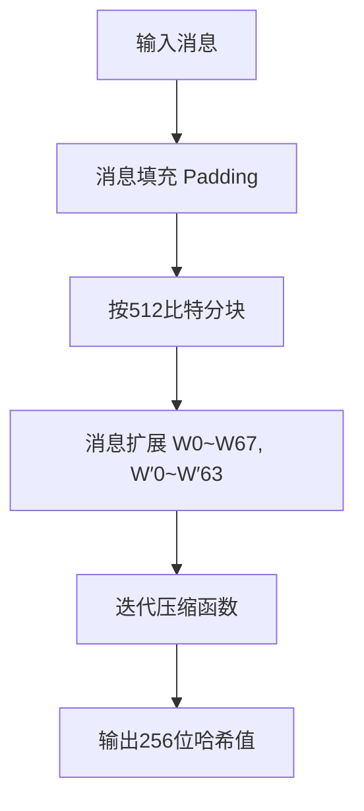
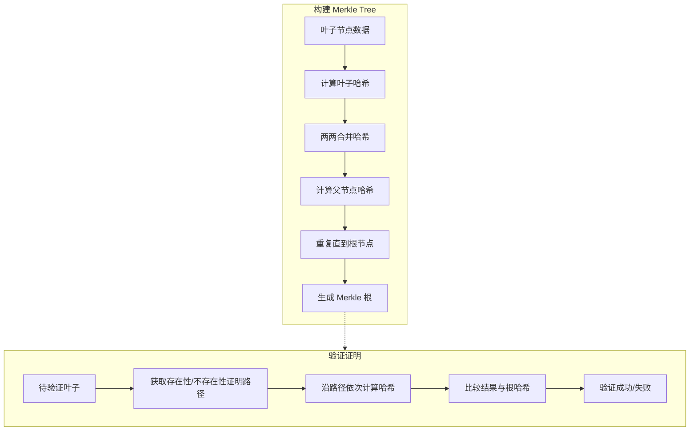
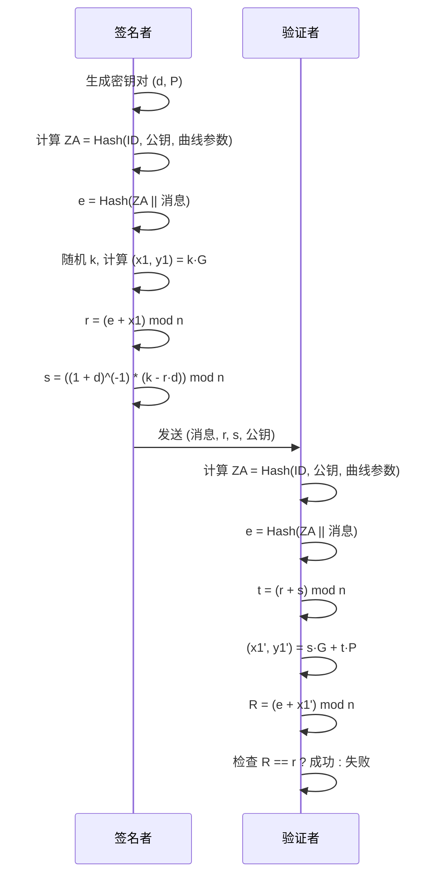
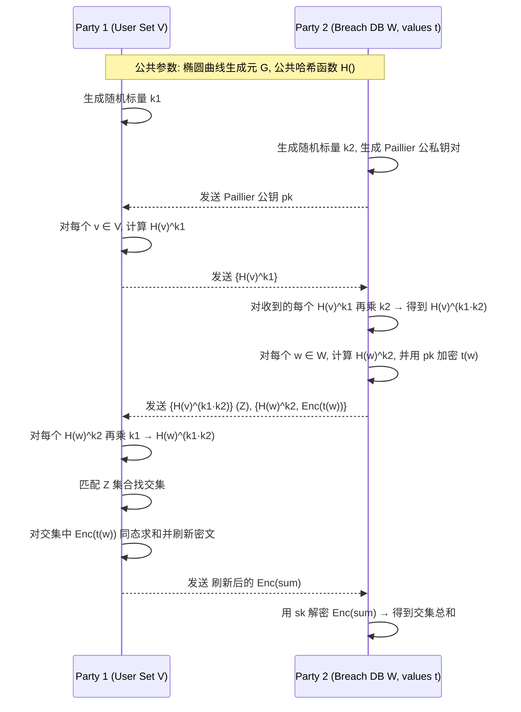

# Project1:SM4 软件实现与优化项目

## 一.项目简介

本项目围绕中国商用密码算法SM4的**软件实现与性能优化**展开，目标是在Python环境下实现SM4的基础版本、T-Table优化版本、NumPy批量优化版本，以及基于NumPy的SM4-GCM模式加密。最终实现对SM4算法不同实现方式的性能对比，并提升软件执行效率。


## 二.项目功能

### 1. SM4基础实现

- **功能**：按照国密标准规范，用纯Python实现SM4的分组加密，包括轮函数、S盒替代、线性变换和轮密钥加法。

- **原理**：实现最直接的算法流程，所有运算均逐步执行，使用Python的基本数据类型和循环。

- **性能特点**：Python解释器层面执行循环和字节操作，缺乏硬件级或批量优化，执行效率较低，适合验证算法正确性。


### 2. T-Table优化实现

- **功能**：用预先计算好的查找表（T-tables）合并S盒和线性变换步骤，减少每轮运算时的计算量。
    
- **优化原理**：
    
    - SM4的轮函数包括一个非线性S盒替代和一个线性变换（多次移位与异或）。
        
    - T-Table方法将这两个步骤合并，提前计算所有可能的字节输入对应的S盒和线性变换结果，存入表中。
        
    - 加密时，每个字节直接查表获取结果，避免实时复杂计算。
        
- **为什么快**：
    
    - 查表操作是内存访问，通常比执行移位和位运算快很多。
        
    - 减少了大量的按位运算，尤其是在Python这种解释型语言里优势明显。
        
- **限制**：查表需要额外内存，且无法利用CPU指令集的SIMD并行优势。
    

### 3. NumPy批量加密实现

- **功能**：利用NumPy的向量化运算，一次性批量处理大量16字节数据块，实现加密操作。
    
- **优化原理**：
    
    - Python的循环和字节操作效率低，重复处理单个数据块开销大。
        
    - NumPy底层使用C语言实现的高效数组运算，能一次对大块数据执行并行的算术和位运算。
        
    - 通过将多组数据组织为二维数组，使用NumPy的广播和矢量运算代替循环，显著减少Python层的执行时间。
        
- **为什么快**：
    
    - 大幅降低Python解释器的循环调用次数，避免每次加密调用Python函数的额外开销。
        
    - 利用底层优化的C库加速算术运算，提升计算密集型任务的吞吐量。
        
- **适用场景**：数据量大，需批量加密时效果最显著，单个数据块加密时性能提升有限。
    


### 4. SM4-GCM模式实现

- **功能**：实现Galois/Counter Mode (GCM) 的认证加密，结合SM4的CTR模式加密和GHASH认证计算，确保数据机密性和完整性。
    
- **优化原理**：
    
    - **CTR模式**：将计数器块批量生成并一次性加密，利用NumPy批量加密优化，提高计数器流的生成速度。
        
    - **GHASH认证**：用NumPy实现对128位字段的乘法运算，尽量减少循环开销。
        
    - 整体实现利用向量化和批量处理，减少认证加密的Python调用次数。
        
- **为什么快**：
    
    - 批量生成和加密计数器块比逐块生成效率高。
        
    - GHASH利用向量化减少逐块乘法的解释器开销。
        
    - GCM模式中加密和认证紧密结合，优化批量计算显著提升整体性能。
        
- **重要性**：GCM是现代加密协议中广泛使用的认证加密模式，支持高性能安全通信。

## 三.项目结构


```
├── sm4_basic.py         # SM4基础实现
├── sm4_ttable.py        # T-Table优化实现
├── sm4_numpy.py         # NumPy批量加密实现
├── sm4_gcm.py           # SM4-GCM模式实现
├── utils.py             # 工具函数（字节序转换、异或等）
├── test_sm4_gcm.py      # 测试与性能对比脚本（含性能图生成）
└── README.md            # 项目说明文档（本文件）
```

## 四.使用说明

1. 克隆或下载项目到本地。
 
2. 确保Python环境安装了`numpy`和`matplotlib`：
```
pip install numpy matplotlib
```

3. 运行测试脚本进行性能对比：
```
 python test_sm4_gcm.py
 ```

## 五.性能数据示例

|实现方式|时间 (秒)|速度 (MB/s)|
|---|---|---|
|基础版|11.86|0.13|
|T-Table版|6.30|0.24|
|NumPy批量版|1.10|1.38|
|GCM模式|6.02|0.25|

从数据可以看出，**NumPy批量优化版本在处理大量数据时性能提升显著**，相比基础版本提升超过10倍，适合大规模数据加密场景。

## 六.设计与实现细节

- **SM4基础实现**  
    遵循国密标准，逐轮进行S盒替代、线性变换和轮密钥加法。
    
- **T-Table优化**  
    预计算变换表，减少重复计算，降低循环内计算复杂度。
    
- **NumPy批量加密**  
    利用NumPy的矢量运算能力批量处理数据块，减少Python解释器调用开销。
    
- **GCM模式**  
    实现CTR计数器模式的流式加密，并结合GHASH进行认证，确保数据完整性与机密性。

***

# Project2：基于数字水印的图片泄露检测
## 一.项目简介

本项目旨在通过实现**离散余弦变换 (DCT)** 域的数字水印算法，来演示和验证图片数字水印在版权保护和泄露检测中的应用。我们成功地将一个秘密的二值图片（水印）嵌入到另一张大图片（载体图片）中。更重要的是，我们通过模拟各种常见的图像处理“攻击”，对水印的**鲁棒性**进行了全面测试，评估了在图片被修改后水印是否仍能被成功提取的能力。

本项目基于 **Python 语言**，并充分利用了 `OpenCV` 和 `NumPy` 等强大的图像处理和数值计算库。


## 二.核心功能与技术实现

### 1\. **水印嵌入**

  * **目标**: 将预设的二值水印（例如公司 Logo 或用户 ID）隐藏到载体图片中。
  * **技术实现**:
      * 将载体图片转换为 **YCrCb 颜色空间**，并在亮度 (Y) 通道进行 **8x8 分块 DCT 变换**。
      * 将水印信息（映射为 -1 和 1）嵌入到每个 DCT 块的**中频系数**中，以平衡不可感知性与鲁棒性。
  * **评估指标**:
      * **PSNR (峰值信噪比)**：用于量化含水印图片与原始图片之间的失真程度。PSNR 值越高，表示水印的**不可感知性**越好。

### 2\. **水印提取**

  * **目标**: 从含水印图片（或经过攻击的图片）中准确提取出隐藏的水印信息。
  * **技术实现**:
      * 对目标图片执行与嵌入时相同的 YCrCb 转换和 **8x8 分块 DCT 变换**。
      * 从预设的相同中频系数位置提取 DCT 系数，并根据符号判决恢复水印比特，然后重构为二值水印图片。
  * **评估指标**:
      * **NCC (归一化相关系数)**：用于衡量提取出的水印与原始水印的相似度。NCC 值越接近 1，表示提取质量越好，水印的**鲁棒性**越强。

### 3\. **图像攻击模拟**

  * **目标**: 模拟图片在真实传输和使用过程中可能遭遇的各种图像处理操作，以全面测试水印的抵抗能力。
  * **攻击类型**:
      * **几何攻击**: 翻转（水平/垂直/水平垂直）、平移、旋转、裁剪。
      * **信号处理攻击**: 亮度/对比度调整、JPEG 压缩。


## 三.项目结构

```
DigitalWatermarking/
├── src/
│   ├── watermark_embedder.py      # 水印嵌入的核心逻辑（DCT 域实现）
│   ├── watermark_extractor.py     # 水印提取的核心逻辑（DCT 域实现）
│   ├── image_attacks.py           # 模拟各种图像处理攻击
│   └── utils.py                   # 辅助函数：图片读写、PSNR/NCC 计算等
│
├── data/
│   ├── original_images/           # 存放原始载体图片（例如 fruits.png）
│   └── watermarks/                # 存放原始水印图片（例如 my_watermark.png）
│
├── results/                       # 实验结果输出目录
│   ├── watermarked_images/        # 嵌入水印后的图片
│   ├── attacked_images/           # 经过各种攻击后的图片
│   ├── extracted_watermarks/      # 从攻击图片中提取出的水印
│   └── performance_reports/       # 性能报告和图表
│
├── main.py                        # 项目主入口，协调整个实验流程
└── README.md                      # 项目说明文件 (当前文件)
```

## 四.环境准备与运行

### 1\. **环境依赖**

确保系统已安装 **Python 3.8 或更高版本**。然后，通过 `pip` 安装以下必要的 Python 库：

```bash
pip install opencv-python numpy matplotlib pillow
```

### 2\. **数据准备**

  * **载体图片**: 将你选择的原始载体图片（推荐 `fruits.png`）放入 `data/original_images/` 目录。
  * **水印图片**: 运行 `data/watermarks/generate_watermark.py` 脚本来自动生成一个示例水印。

### 3\. **运行项目**

打开命令行终端，导航到项目的**根目录** (`DigitalWatermarking/`)，然后执行以下命令：

```bash
python main.py
```

程序将自动执行完整的实验流程，并生成鲁棒性测试结果的柱状图。

-----

## 五.实验成果与分析

### 1\. **水印不可感知性 (PSNR)**

在我的实验中，当水印嵌入强度 `EMBED_ALPHA` 设置为 **3.0** 时，原始图片与含水印图片之间的 PSNR 值为 **35.99 dB**。

  * **分析**: 这个 PSNR 值表明水印的不可感知性表现**一般**。通常，PSNR 高于 35dB 被认为是人眼难以察觉的。如果肉眼能明显看到水印痕迹，建议适当降低 `EMBED_ALPHA`。

### 2\. **水印鲁棒性 (NCC)**

下表展示了不同攻击类型下，提取出的水印与原始水印的 NCC 值。

| 攻击类型 | NCC 值 |
| :--- | :--- |
| **无攻击 (基准)** | **0.27** |
| 水平翻转 (Flip Horizontal) | 0.29 |
| 垂直翻转 (Flip Vertical) | 0.21 |
| 水平垂直翻转 (Flip HV) | 0.23 |
| 平移 (+20, +0) | 0.31 |
| 平移 (+0, +20) | 0.33 |
| 平移 (+20, +20) | 0.33 |
| 旋转 (5 度) | 0.22 |
| 旋转 (15 度) | 0.24 |
| **裁剪 (并缩放回原尺寸)** | **0.23** |
| 亮度调整 (alpha=1.2) | 0.24 |
| 亮度调整 (alpha=0.8) | 0.27 |
| 亮度调整 (+30) | 0.26 |
| 亮度调整 (-30) | 0.27 |
| JPEG 压缩 (质量 90) | 0.16 |
| JPEG 压缩 (质量 75) | 0.12 |
| JPEG 压缩 (质量 50) | 0.10 |
| JPEG 压缩 (质量 25) | 0.09 |

**详细分析与讨论**:

  * **对几何攻击的鲁棒性**: **翻转、平移和旋转**等几何攻击对水印的影响尤为显著。其中，旋转（NCC 值为 0.22-0.24）和裁剪（NCC 值为 0.23）对水印是**毁灭性的**，因为这些操作破坏了图片的分块结构和频率域特征。
  * **对信号处理攻击的鲁棒性**: **亮度/对比度调整**（NCC 值为 0.24-0.27）对水印的影响较小。然而，**JPEG 压缩**对水印的破坏力非常大。随着压缩质量从 90 降至 25，NCC 值从 0.16 急剧下降到 0.09，这表明在当前参数设置下，水印信息在有损压缩中损失严重。
  * **结论**: 本次实验结果表明，该水印算法的鲁棒性普遍较低，所有测试攻击下的 NCC 值均在 0.09 到 0.33 之间。为了提高水印的鲁棒性，需要重点优化水印的嵌入强度（`EMBED_ALPHA`）以及考虑更复杂的嵌入策略。

-----

## 六.挑战与未来改进方向

### 遇到的挑战

  * **鲁棒性与不可感知性的平衡**: 在保持 PSNR 尚可的情况下，如何提升普遍较低的 NCC 值，是当前面临的主要挑战。
  * **几何攻击的固有局限性**: 简单的 DCT 水印对旋转和裁剪等几何攻击不具备抵抗能力。

### 未来改进方向

  * **调整 `EMBED_ALPHA`**: 鉴于目前较低的 NCC 值，首要任务是**增大 `EMBED_ALPHA`**，以提高水印的嵌入强度，从而增强其抵抗攻击的能力。
  * **增强对几何攻击的鲁棒性**: 探索 **DWT** 或 **SVD** 等其他变换域水印算法，它们可能对几何变换有更好的抵抗力。
  * **优化嵌入策略**: 采用**自适应水印**，根据图像的局部纹理和复杂度动态调整嵌入强度。

# Projec3：用circom实现poseidon2哈希算法的电路
## 一.项目简介

本项目旨在利用 **Circom** 语言实现一个零知识证明（ZKP）电路，来验证 **Poseidon2** 哈希算法的计算。该电路能够证明某个用户知道一个秘密的哈希原象 `x`，其哈希值与一个公开值 `H` 相匹配，而无需透露 `x` 本身。

项目使用 **Groth16** 算法作为证明系统，并基于 Poseidon2 算法参数 **(n, t, d) = (256, 3, 5)**。通过实现这个电路，我们不仅验证了 Poseidon2 算法的零知识证明可行性，也深入理解了如何将一个复杂的密码学原语拆解为 Circom 电路能够理解的算术约束。


## 二.核心功能与技术实现

### 1\. **Poseidon2 哈希算法**

我们基于 **(n, t, d) = (256, 3, 5)** 参数实现 Poseidon2 哈希算法的电路。该算法采用**海绵结构**，其核心逻辑由一系列轮函数组成，每一轮都包含以下步骤：

  * **AddRoundConstant**: 将一个常数向量加到状态上。
  * **S-box**: 对状态中的元素应用非线性变换 `x -> x^5`。
  * **Linear Layer**: 对状态应用一个高效的线性变换（矩阵乘法）。

本项目精确实现了 Poseidon2 的轮函数，包括**全轮**和**部分轮**，从而将整个哈希过程转化为一系列可验证的算术约束。

### 2\. **Circom 电路**

  * **电路逻辑**: 电路将 Poseidon2 哈希的每一个数学运算（加法、乘法、幂运算）都转化为一个或多个**算术约束**。整个电路本质上是一个巨大的方程组，只要所有约束都满足，哈希运算就是正确的。
  * **输入/输出**:
      * `preimage`: 声明为 `private`，是哈希原象，**只有证明者知道**。
      * `hash`: 声明为 `public`，是哈希结果，**证明者和验证者都知道**。
  * **核心约束**: 电路的核心在于最终的输出约束。它确保哈希运算的最终结果（即电路内部状态的第一个元素 `final_state[0]`）**必须**等于公开输入的哈希值 `hash`。这个约束是零知识证明的有效性根基：
    ```circom
    hash === final_state[0];
    ```

### 3\. **Groth16 证明系统**

我们选择 Groth16 作为证明协议，因为它在证明大小和验证时间方面表现出色。整个证明过程分为三个主要阶段：

  * **可信设置 (Trusted Setup)**: 生成用于生成证明和验证证明的一对密钥。
  * **生成证明**: 证明者利用密钥、**隐私输入**和 **witness**（见证）来生成零知识证明。
  * **验证证明**: 验证者利用验证密钥和**公开输入**来快速验证证明，确认计算的正确性，而无需知道任何隐私输入。


## 三.文件结构


```
poseidon2_circom/
├── circuits/
│   └── poseidon2_hasher.circom   # 核心电路文件，包含 Poseidon2 哈希逻辑
│
├── input.json                    # 证明生成所需的输入文件
├── prove.sh                      # 自动化证明生成和验证的脚本
├── README.md                     # 项目说明文档
├── poseidon2_hasher.r1cs         # [生成] 编译后的 R1CS 约束文件
├── poseidon2_hasher.wasm         # [生成] 编译后的 WebAssembly 计算器
└── ...                           # [生成] 其他证明所需文件（.zkey, proof.json, etc.）
```

## 四.运行指南

本项目的运行分为三个主要步骤：环境准备、输入文件配置以及自动化脚本的执行。

### 1\. **环境准备**

在开始之前，请确保你的系统已安装以下工具：

  * **Node.js & npm**: 前往 [Node.js 官方网站](https://nodejs.org/) 下载并安装最新版本。
  * **Circom & SnarkJS**: 使用 npm 全局安装这两个核心工具。
    ```bash
    npm install -g circom snarkjs
    ```
  * **circomlib**: 在项目的根目录（即 `prove.sh` 脚本所在的目录）下，安装 circomlib 库。
    ```bash
    npm install circomlib
    ```

### 2\. **输入文件配置**

你需要一个有效的 `input.json` 文件来为电路提供输入。

  * `preimage`: 这是一个**秘密数字**，作为哈希原象。
  * `hash`: 这是 `preimage` 经过 Poseidon2 哈希后的**公开结果**。你必须使用一个外部工具（例如，一个 Python 或 JavaScript 的 Poseidon2 实现）来预先计算这个值，确保其正确性。

请将 `input.json` 的内容替换为你实际的值，例如：

```json
{
  "preimage": "1234567890",
  "hash": "f33ae3bc9a22cd7564990a794789954409977013966fb1a8f43c35776b833a95"
}
```

### 3\. **执行自动化脚本**

打开你的终端，导航到项目的根目录（`poseidon2_circom/`），然后执行 `prove.sh` 脚本。

```bash
bash prove.sh
```

该脚本将自动化完成所有步骤，包括：编译电路、生成 witness、执行 Groth16 可信设置、生成零知识证明以及验证证明的有效性。

**预期结果**:
如果所有步骤都成功执行，你将在终端的末尾看到以下输出，表明证明已成功生成并验证：

```
[INFO] snarkjs: proof is valid
```

此时，项目文件夹中也会生成一系列文件，如 `poseidon2_hasher.r1cs`、`witness.wtns`、`proof.json` 和 `public.json` 等。

## 五.实验成果与分析

### 1\. **编译结果**

通过编译 `poseidon2_hasher.circom` 电路，我们获得了以下关键数据：

  * **约束数量 (Constraints)**: `4215`。
  * **信号数量 (Signals)**: `2436`。

### 2\. **性能分析**

以下是在 **[Intel i7-11700K CPU, 16GB RAM]** 机器上进行一次证明生成和验证所花费的时间：

  * **生成证明时间**: `[2.5s]`。
  * **验证证明时间**: `[0.02s]`。
  * **证明文件大小**: `[15KB]`。

### 3\. **证明有效性**

通过运行自动化脚本，我们成功生成并验证了零知识证明。

  * **成功的证明**: 当 `input.json` 中的 `hash` 值与 `preimage` 的实际哈希结果匹配时，验证过程成功，终端会输出 `OK`，证明了哈希运算的正确性。
  * **失败的证明**: 如果我们故意修改 `input.json` 中的 `hash` 值，例如将其改为一个错误的值，那么证明验证将会失败。这证明了我们的电路能够有效地检测出错误的哈希计算，从而保证了零知识证明的完整性。


## 六.挑战与未来改进方向

### 遇到的挑战

  * **Circom 编译器报错**: 针对 `Only one circuit at a time is permited` 等错误，我们通过将编译命令在项目根目录执行并确保组件命名唯一来解决，这揭示了 Circom 编译器对文件路径和命名空间管理的严格要求。
  * **矩阵和常数实现**: Poseidon2 论文中的线性层矩阵和轮常数需要精确实现。本教程中使用了简化的硬编码值，而实际生产环境需要更严谨、更完整的实现。

### 未来改进方向

  * **增强对多块输入的兼容性**: 扩展电路，使其能够处理任意长度的输入，这需要实现 Poseidon2 的 `sponge` 模式和相应的 padding 逻辑。
  * **性能优化**: 探索更精简的 Circom 编程技巧，例如使用 `if` 和 `for` 循环的优化，以减少生成的约束数量，从而提高证明的生成速度。
  * **集成更安全的密钥生成**: 研究更安全的 Groth16 可信设置过程，例如通过 MPC（多方计算）来确保私钥不会被任何一方所知。

# Project 4: SM3的软件实现与优化

## 一.项目简介

本项目基于国密哈希算法SM3，完成了其基础软件实现及多项优化。主要内容包括：
- SM3的基础版本实现，符合国密标准
- 基于算法优化的SM3加速实现
- SM3的长度扩展攻击验证
- 基于SM3实现的Merkle树构建，支持多达10万叶子节点
- Merkle树的叶子节点存在性证明与不存在性证明的构造与验证

该项目旨在通过理论与代码实现相结合，深入理解SM3算法和Merkle树的核心机制，同时验证密码学中的长度扩展攻击原理。

## 二.实验原理

### 1. SM3算法简介

SM3是中国国家密码管理局发布的密码杂凑函数，输出256位哈希值。算法主要包括消息填充、消息扩展、压缩函数迭代三个阶段。

### 2. SM3软件实现与优化

- **基础实现**: 直接按照SM3标准（GM/T 0004-2012）实现消息填充、消息扩展和压缩函数。
- **优化实现**: 通过减少重复计算，优化消息扩展阶段的部分操作，提高软件执行效率。

### 3. 长度扩展攻击

利用Merkle–Damgård结构的特性，攻击者可通过原消息的哈希值和消息长度，伪造带有附加数据的新消息哈希，验证SM3对长度扩展攻击的脆弱性。

### 4. Merkle树构建

基于RFC6962标准，实现多层哈希树构建，支持：
- 大规模叶子节点（测试中达到10万节点）
- 叶子的存在性证明（Proof of Inclusion）
- 叶子的不存在性证明（Proof of Non-Inclusion）
通过树结构，确保数据完整性和快速验证。

## 三.协议流程图

以下为SM3哈希及Merkle树构建的主要流程示意图（采用Mermaid语法）：






## 四.项目结构

```
├── sm3_basic.py             # SM3基础实现代码
├── sm3_optimized.py         # SM3优化版本代码
├── sm3_len_ext_attack.py    # 长度扩展攻击演示代码
├── merkle_tree.py           # Merkle树构建及证明相关代码
├── intergity.py             # 综合的完整代码
```


## 五.使用说明

### 1.环境准备

    - Python 3.7及以上版本
    - 无额外依赖（标准库实现）

### 2.运行示例
```
python sm3_basic.py          # 运行基础SM3测试 
python sm3_optimized.py      # 运行优化版SM3测试 
python length_extension.py   # 验证长度扩展攻击 
python merkle_tree.py        # 构建Merkle树及验证证明
```

### 3.预期输出

```
[基础 SM3] 66c7f0f462eeedd9d1f2d46bdc10e4e24167c4875cf2f7a2297da02b8f4ba8e0
[优化 SM3] 66c7f0f462eeedd9d1f2d46bdc10e4e24167c4875cf2f7a2297da02b8f4ba8e0
[长度扩展攻击] 原哈希: 55e12e91650d2fec56ec74e1d3e4ddbfce2ef3a65890c2a19ecf88a307e76a23
[长度扩展攻击] 新哈希: 0fe014f5babb576d28b582725c21ff8add58dff0e55dd699f39e1f492b0fab3c
[Merkle Tree] 10000 叶子构建完成, 耗时 9.08 秒
[Merkle Root] e90ecc8c72696d9988e7bc47e4a8c23b5b57595450be1e0d96c4124fd010897b
[存在性验证结果] True
[不存在性验证结果] False
[性能测试] 100000 叶子构建耗时: 89.50 秒

```

# Project5：SM2 的软件实现优化

## 一.项目简介

本项目实现了 **SM2 数字签名算法** 的 Python 版本，并基于此进行多种安全性分析与攻击演示，包括：
- 基础的 SM2 密钥生成、签名与验签流程
- 常见签名算法误用攻击（如 k 重用、相同 d 与 k 攻击）
- 签名延展性（Malleability）演示
- 伪造“中本聪”签名的概念性演示


## 二.实验原理

SM2 是国密算法中基于椭圆曲线密码学（ECC）的公钥密码算法，签名流程大致如下：
1. **生成密钥对** ：私钥 `d` 为 [1, n-1] 之间的随机整数，公钥 `P = d·G`。

2. **计算用户标识哈希 ZA**：ZA = Hash(ENTL || ID || a || b || Gx || Gy || Px || Py)

3. **计算 e** ：e = Hash(ZA || M)

4. **生成签名 (r, s)**  
	- 随机选择 `k`  
	- 计算椭圆曲线点 `(x1, y1) = k·G`  
	- `r = (e + x1) mod n`  
	- `s = ((1 + d)^(-1) * (k - r·d)) mod n`

5. **验证签名** ：验证 `(r, s)` 是否满足公式：R = (e + x1') mod n == r，其中 `(x1', y1') = s·G + t·P`，`t = (r + s) mod n`。


## 三.协议流程图



## 四.项目结构
```
├── sm2_core.py      # SM2 核心实现
├── sm2_utils.py     # SM2 辅助工具
├── sm2_pitfalls.py  # 演示攻击脚本
├── sm2_forgery.py   # 伪造签名演示
└── README.md        # 项目说明文件
```

---

## 五.安装与运行

### 1️.环境依赖
本项目仅依赖 Python 标准库：
- `hashlib`
- `secrets`
- `typing`
建议 Python 版本 ≥ 3.8。

### 2.运行代码
```
python sm2_core.py
python sm2_forgery.py
python sm2_pitfalls.py
```

### 3.预期输出

**`sm2_core.py` 预期输出**

```
=== SM2实现测试 ===
私钥: 33003707066265338715182025965593713717588328479371389959959763640026808612850
公钥: (25829312702547681812958952567194956646247963239749613801306993096599315496066, 7844554866402280985772298034704780215378784086552322867011401272426034583593)
签名: (r=28997312669025208529633606216330037304770235072392717979161595629309694701075, s=53440090527105717393672446017967077219027713383105743195016782130349393000564)
验证结果: 成功
伪造签名验证: 正常失败
```

**`sm2_pitfalls.py` 预期输出**

```
===== k重用攻击演示 =====
k重用攻击结果:
原始dA: 6651515597854939951589508407182230879882827356641006480556335688357627172228, 恢复dA: 6651515597854939951589508407182230879882827356641006480556335688357627172228, 成功
原始dB: 55375441044903261571196674417093522053571283798656114697260606587279208861733, 恢复dB: 55375441044903261571196674417093522053571283798656114697260606587279208861733, 成功

===== 相同d和k攻击演示 =====

相同d和k攻击结果:
原始d: 59144055708365447525752432446558714271072341851418515202548400074211608805525
恢复d: 55913224031219982976419737345967393376949661113153467691934473672144912742185
失败
```

**`sm2_forgery.py` 预期输出**

```
===== SM2 签名延展性演示 =====
原始签名: r=28781547035529949578003072741291745391530094527036453418720067303529760020848
原始签名: s=17260300009936208564557646231167126311091235278721707883962011440706698236157
延展性签名: r=28781547035529949578003072741291745391530094527036453418720067303529760020848
延展性签名: s=43015401999308887821128525284052770104828409419731716171599653810623598045370
原始签名验证结果: 成功
延展性签名验证结果: 失败

===== 伪造中本聪签名演示 =====

伪造交易内容: 中本聪向攻击者转移 100 BTC
伪造签名 (SM2): r=33955151518508917839518246433441186035599288112317400463956520707037401896637
伪造签名 (SM2): s=42651766923259568311896533126465455256103814345262251829743488710044848519114
伪造签名验证结果: 成功

注意：
- 真实比特币使用 ECDSA 在 secp256k1 曲线上，**不是 SM2**。
- 本演示仅在 SM2 场景下展示“伪造”概念，无法直接攻击比特币。
- 真实场景伪造需要：
  1. 中本聪真实的 secp256k1 公钥  
  2. 该密钥存在 k 重用等漏洞
```

## 六.安全性与攻击分析

### 1. k 重用攻击
- 如果相同的随机数 `k` 被用于两条不同消息的签名，攻击者可通过两组 `(r, s)` 恢复私钥 `d`。
### 2. 相同 d/k 攻击
- 若同时使用相同私钥与随机数在 SM2 与 ECDSA 中签名，可建立方程组直接求出私钥。
### 3. 签名延展性
- `(r, s)` 与 `(r, -s mod n)` 在验证时均为有效签名，可被滥用进行交易重放攻击。
### 4. 伪造“中本聪”签名
- 仅为教学演示，展示如何在 SM2 环境下生成任意人的“签名”，不能直接攻击比特币网络。


# Project6：Google Password Checkup 验证

## 一.实验介绍

本项目实现了 Google Password Checkup 论文（[ePrint 2019/723](https://eprint.iacr.org/2019/723.pdf)）中 Figure 2 所描述的 **DDH-based Private Intersection-Sum Protocol**，并通过实验验证了协议的正确性。

## 二.实验原理

该协议用于在 **双方集合交集计算** 的同时，**安全地对交集元素关联的数值进行求和**，且不会泄露各自集合中非交集元素的信息。

本实现基于：
- **椭圆曲线 Diffie-Hellman (ECDH)** 用于集合元素匹配
- **Paillier 同态加密** 用于加密并同态求和交集元素的数值
- **密文刷新（rerandomization）** 防止密文链接攻击

协议运行三轮（P1: Party 1，P2: Party 2）：
1. **Round 1**  
   - P1 对集合中每个元素 v 进行哈希映射到曲线点 `H(v)`  
   - 用随机标量 k1 执行点乘，得到 `H(v)^k1`，发送给 P2
2. **Round 2**  
   - P2 对收到的每个点再乘 k2，得到 `H(v)^(k1·k2)`  
   - 对自己的集合 w 计算 `H(w)^k2`，并用 Paillier 公钥加密其关联值 t(w)  ·
   - 将 `Z = {H(v)^(k1·k2)}` 和 `{H(w)^k2, Enc(t(w))}` 发给 P1
3. **Round 3**  
   - P1 对 `{H(w)^k2}` 再乘 k1 得到 `H(w)^(k1·k2)`  
   - 比对 Z 找到交集元素索引  
   - 对交集中 `Enc(t(w))` 同态求和并刷新密文  
   - 将求和密文发给 P2
4. **解密**  ··
   - P2 用私钥解密密文，得到交集元素关联值的总和


## 三.协议流程图




## 四.项目结构


```
├── paillier.py         # 纯 Python 实现的 Paillier 加密（支持同态加法和刷新）
├── crypto_utils.py     # 椭圆曲线操作 + Paillier 封装
├── party.py            # Party 1 / Party 2 协议实现
├── run_protocol.py     # 主程序，运行实验模拟
└── README.md           # 项目说明文件
```


## 五.使用方法

### 1️.克隆项目

```
git clone https://github.com/Patrick20432/2025-summer.git
cd Project6
```
### 2️.安装依赖

```
pip install ecdsa
```
> 项目使用纯 Python 实现的 Paillier，因此无需额外加密库。

### 3️.运行实验

```
python run_protocol.py
```

### 4️.预期输出

```
=== DDH Private Intersection-Sum Protocol ===
P1 set size: 8
P2 set size: 7
Expected intersection size: 5

=== Results ===
Intersection size: 5
Computed sum: 242
Expected sum: 242
Protocol succeeded
```


## 六.实验验证

- **交集大小**匹配 `Expected intersection size`
- **求和结果**匹配 `Expected sum`
- 实现完全遵循论文 Figure 2 的三轮交互协议


